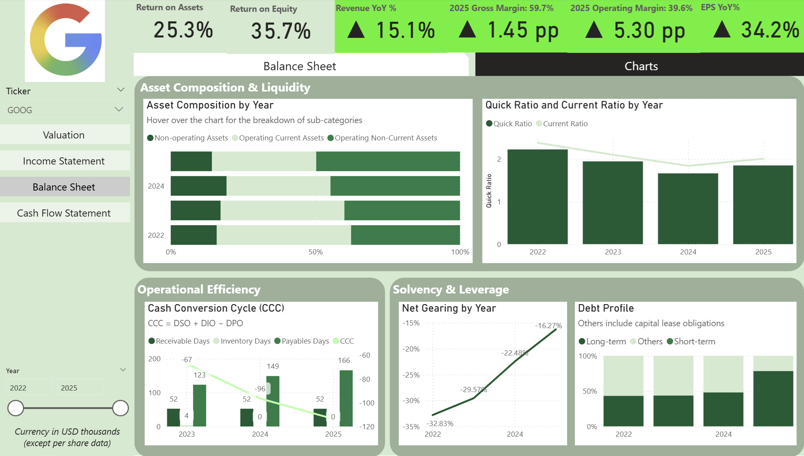

# Quantimental Strategy (Part 1): Tech Sector Fundamental Intelligence Dashboard

The **"Quantimental"** approach represents the fusion of **Quantitative** and **Fundamental analysis**, combining the data-driven rigor of mathematical modeling with the deep structural insights of equity research.

[This project](https://app.powerbi.com/view?r=eyJrIjoiMWRiYmE1ZGQtY2FlNi00N2EyLTllNmQtMTEwOTQyOGIxMTM5IiwidCI6IjZjMWQ0MTUyLTM5ZDAtNDRjYS04OGQ5LWI4ZDZkZGNhMDcwOCIsImMiOjEwfQ%3D%3D) serves as the foundational pillar of the strategy, providing an automated fundamental analysis framework for the "Big Four" tech leaders: **Google, Meta, Nvidia, and Tesla**. It is designed to work in synergy with [Part 2: LSTM Autoencoder Anomaly Detection](https://github.com/cckmwong-data/stock_price_anomaly), which utilizes Deep Learning to identify market mispricings through reconstruction error analysis.

---

## The Integration: Fundamentals + Technical Analysis
Most investment tools provide either financial data or technical indicators in isolation. This project integrates both to create a high-conviction decision engine:

* **[1. The Fundamental Core (This Project)](https://app.powerbi.com/view?r=eyJrIjoiMWRiYmE1ZGQtY2FlNi00N2EyLTllNmQtMTEwOTQyOGIxMTM5IiwidCI6IjZjMWQ0MTUyLTM5ZDAtNDRjYS04OGQ5LWI4ZDZkZGNhMDcwOCIsImMiOjEwfQ%3D%3D):** Determines **Intrinsic Value** using a dynamic 2-stage DCF model. It answers: *"What is this company actually worth based on cash flow?"*
* **[2. The AI Layer (LSTM Autoencoder):](https://github.com/cckmwong-data/stock_price_anomaly)** Detects **Price Anomalies** in Tesla (TSLA) stock (2015-2025). It answers: *"Is the current price action deviating irrationally from historical patterns?"*

> **Strategic Use Case:** When the Power BI model identifies a stock as **fundamentally undervalued**, and the LSTM model flags a **negative price anomaly** (high reconstruction error during a price dip), it signals a statistically significant **Mean Reversion** buying opportunity.

---

## Overview
This repository focuses on the **Fundamental Core**, an end-to-end automated platform for financial data analysis. By orchestrating daily extraction of 10-K/10-Q statements (i.e. financial statements) and stock prices via Python and Google Sheets, it eliminates the "stale data" problem inherent in retail research. The dashboard is fully interactive, allowing users to stress-test target prices by adjusting Weighted Average Cost of Capital (WACC), growth rates, and risk-free assumptions in real-time.

---

## Key Highlights
* **Automated ETL:** Python scripts and GitHub Actions refresh the entire financial dataset every 24 hours.
* **Dynamic Valuation:** An interactive 2-stage DCF engine featuring a WACC vs. Terminal Growth sensitivity matrix.
* **Real-Time Pricing:** Integration of live market data using `GOOGLEFINANCE` formulas to ensure valuation gaps are accurate to the latest market close.
* **Full Financial Stack:** Deep-dive modules for Income Statement, Balance Sheet, and Cash Flow (including a visual Cash Flow Bridge).

---

## Dashboard Breakdown

### 1. Intrinsic Valuation & Sensitivity
Compare **Intrinsic Value** vs. **Current Price**. Use interactive sliders to adjust the 10-year growth trajectory and discount rates to see immediate impacts on the target price.

### 2. Income Statement & Margin Analysis
Monitor **revenue growth** and **margin expansion**. Track how COGS, R&D, and SG&A evolve as a percentage of total revenue to identify scaling efficiency.

### 3. Balance Sheet & Liquidity
Analyze **solvency** and **working capital efficiency**. This section highlights the **Cash Conversion Cycle (CCC)**, **Quick Ratio** trends, and **debt profiles**.

### 4. Cash Flow Dynamics
A visual **Cash Flow Bridge** identifies the specific drivers of cash movement, allowing for an "Earnings Quality" check by comparing Net Income to Free Cash Flow.

---

## Skills Demonstrated
✔ **Financial Modeling:** 2-Stage **Discounted Cash Flow (DCF)**, WACC calculation, terminal value estimation, and ratio analysis (Liquidity, Solvency, Profitability).

✔ **Data Engineering:** Automating ETL workflows with **Python** and **GitHub Actions**; managing cloud data pipelines via **Google Sheets API**.

✔ **Business Intelligence:** Advanced **Power BI** development (DAX, dynamic parameters, and user-centric UX design).

✔ **System Architecture:** Designing a synchronized, multi-source data refresh architecture.

---

## How the Pipeline Works
1.  **Extract:** Python scripts scrape the latest 10-K/10-Q filings. Concurrently, Google Sheets pulls live share prices and historical data via native formulas.
2.  **Automate:** **GitHub Actions** triggers the ETL process daily at **23:00 UTC** (post-US market close).
3.  **Sync:** Cleaned and structured data is pushed to Google Sheets, serving as a centralized data warehouse.
4.  **Visualize:** **Power BI Service** performs a scheduled refresh at **00:00 UTC** to update the cloud-hosted dashboard.

---

**Author:** Carmen Wong

---

## Disclaimer
*This project is for informational purposes only. The target prices generated do not constitute financial advice. Always perform your own due diligence before making investment decisions.*
