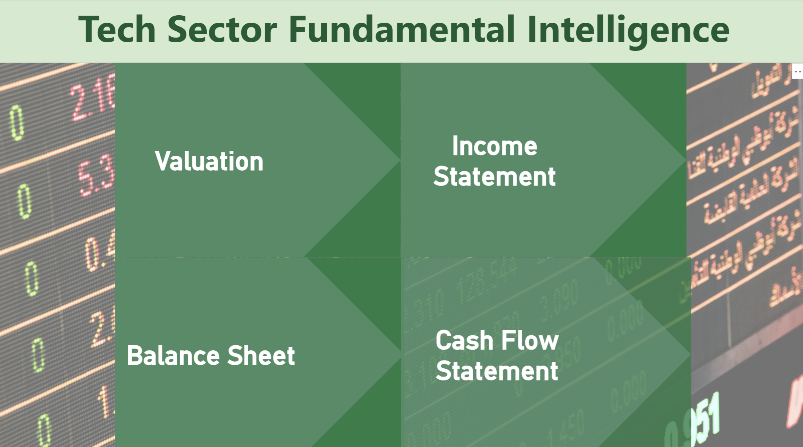
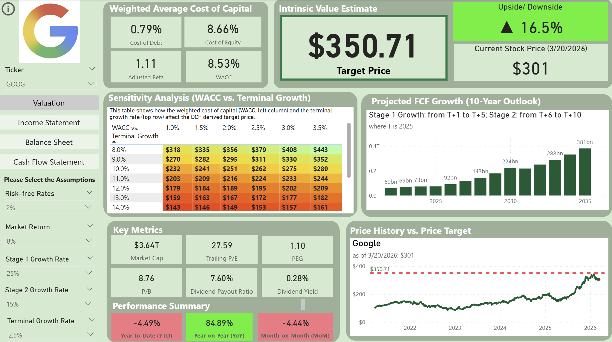
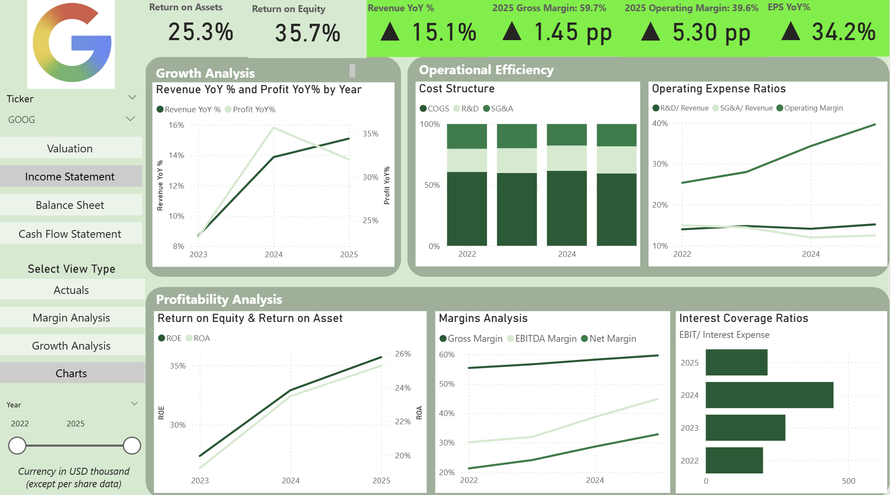
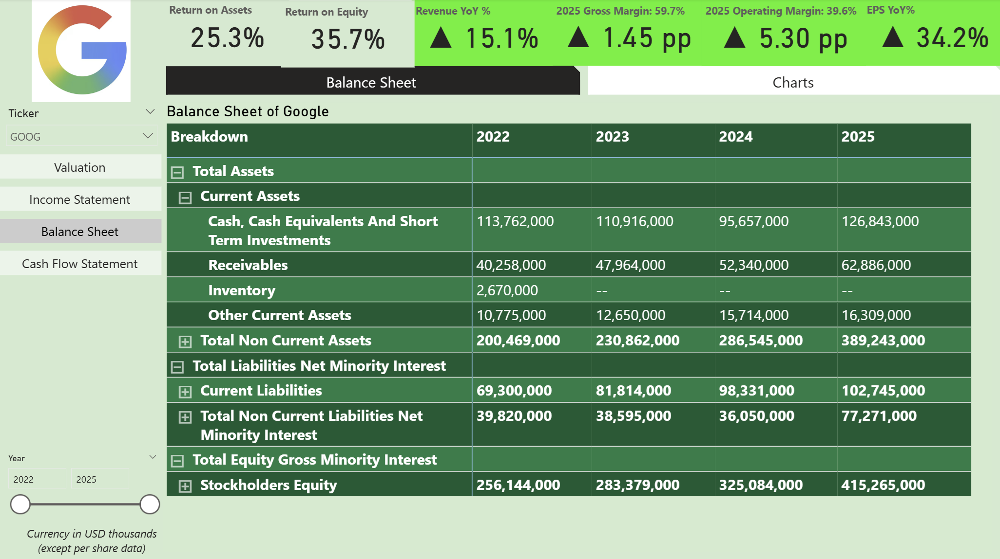
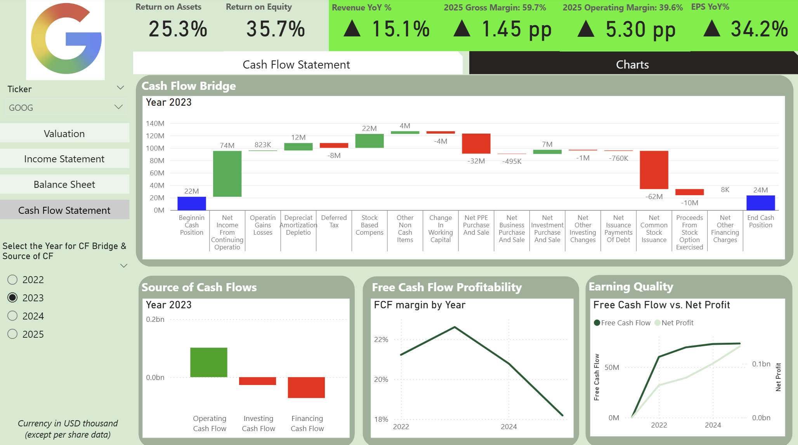

# Quantimental Intelligence: Tech Sector Fundamental Dashboard & AI Anomaly Detection

This project synchronizes deep-dive fundamental analysis for Big Tech (**Google, Meta, Nvidia, Tesla**) with a **[Deep Learning LSTM Autoencoder](https://github.com/cckmwong-data/stock_price_anomaly)** to identify market mispricings and price anomalies.

---

## The Integration: Fundamentals meet AI
Most investment tools provide either financial data or technical indicators. This project integrates both to create a high-conviction decision engine:

* **1. (This project) The Fundamental Core (Power BI):** Determines **Intrinsic Value** using a dynamic 10-year DCF model. It answers: *"What is this company actually worth?"*
* **[2. The AI Layer (LSTM Autoencoder):](https://github.com/cckmwong-data/stock_price_anomaly)** Detects **Price Anomalies** in Tesla (TSLA) stock (2015-2025). It answers: *"Is the current market price deviating irrationally from historical patterns?"*

**Strategic Use Case:** When the Power BI model shows a stock is undervalued, and the LSTM model flags a negative price anomaly (high reconstruction error), it signals a statistically significant **Mean Reversion** buying opportunity.

---

## Project Overview
This project represents the first part of analysis - the Fundamental Core (Power BI), which automates the end-to-end flow of financial data and analysis. By scraping daily financial statements and stock prices via Python and Google Sheet, it eliminates the "stale data" problem common in retail research. Users can interactively adjust growth rates, and risk-free rates to see real-time shifts in target prices.

---

## Key Highlights
* **Automated ETL:** Python scripts & GitHub Actions refresh the entire dataset every 24 hours.
* **Dynamic Valuation:** Interactive 2-stage DCF engine with a WACC/Terminal Growth sensitivity matrix.
* **Full Financial Stack:** Dedicated modules for Income Statement, Balance Sheet, and Cash Flow (including Cash Flow Bridges).
  
---

## Dashboard Breakdown

### 1. Intrinsic Valuation & Sensitivity
Compare **Current Price** vs. **Intrinsic Value**. Use the interactive sliders to stress-test the valuation against different economic scenarios.

### 2. Income Statement & Margin Analysis
Track revenue growth and operational leverage. Monitor how COGS, R&D, and SG&A evolve as a percentage of total revenue.

### 3. Balance Sheet & Liquidity
Analyze solvency and working capital efficiency through the **Cash Conversion Cycle (CCC)** and **Quick Ratio** trends.

### 4. Cash Flow Dynamics
A visual **Cash Flow Bridge** identifies the drivers of cash movement, distinguishing between organic growth and financing activities.

---

## Skills Demonstrated
* **Financial Modeling:** **Discounted Cash Flow (DCF)** analysis, **Weighted Average Cost of Capital (WACC)** calculation, Terminal Value estimation, and Ratio analysis (Liquidity, Solvency, Profitability).
* **Data Engineering:** Automating workflows with **Python** and **GitHub Actions**; managing cloud-based data in **Google Sheets**.
* **Business Intelligence:** Advanced Power BI (DAX, dynamic parameters, and UX design).
* **ETL Pipeline Design:** Connecting disparate data sources into a streamlined, scheduled refresh architecture.

---

## How the Pipeline Works
1.  **Extract:** Python scripts fetch the latest financial statements. Separately, Google Sheets uses internal formulas to pull live share prices and historical close data.
2.  **Automate:** GitHub Actions triggers the ETL process daily at 23:00 UTC.
3.  **Sync:** Cleaned data is pushed to Google Sheets (handling live price formulas).
4.  **Visualize:** Power BI Service performs a scheduled refresh to update the dashboard.

---

## Author
Carmen Wong
